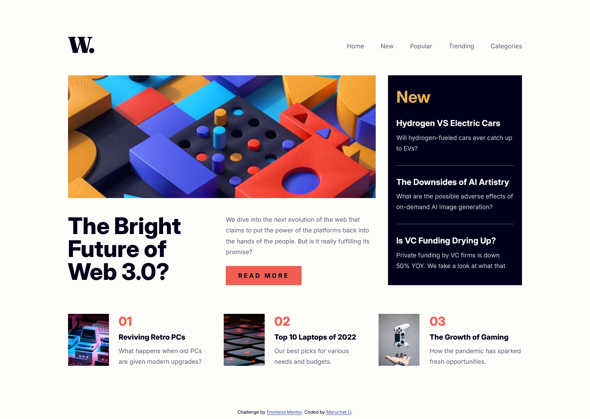

# Frontend Mentor - News homepage solution

This is a solution to the [News homepage challenge on Frontend Mentor](https://www.frontendmentor.io/challenges/news-homepage-H6SWTa1MFl). Frontend Mentor challenges help you improve your coding skills by building realistic projects.

## Table of contents

- [Overview](#overview)
  - [The challenge](#the-challenge)
  - [Screenshot](#screenshot)
  - [Links](#links)
- [My process](#my-process)
  - [Built with](#built-with)
  - [What I learned](#what-i-learned)
  - [Useful resources](#useful-resources)
- [Author](#author)

## Overview

### The challenge

Users should be able to:

- View the optimal layout for the interface depending on their device's screen size
- See hover and focus states for all interactive elements on the page

### Screenshot



### Links

- Solution URL: [Add solution URL here](https://your-solution-url.com)
- Live Site URL: [Add live site URL here](https://your-live-site-url.com)

## My process

### Built with

- Semantic HTML5 markup
- CSS custom properties
- Flexbox
- CSS Grid

### What I learned

Use this section to recap over some of your major learnings while working through this project. Writing these out and providing code samples of areas you want to highlight is a great way to reinforce your own knowledge.

To see how you can add code snippets, see below:

```html
<div class="hamburger hidden" id="myBtn">
  
</div>

<!-- The Modal -->
<div id="myModal" class="modal">
  <!-- Modal content -->
  <div class="modal-content">
    
    <nav class="modal-nav">
      <a href="">Home</a>
      <a href="">New</a>
      <a href="">Popular</a>
      <a href="">Trending</a>
      <a href="">Categories</a>
    </nav>
  </div>
</div>
```

```css
/* The Modal (background) */
.modal {
  display: none; /* Hidden by default */
  position: fixed; /* Stay in place */
  z-index: 1; /* Sit on top */
  left: 0;
  top: 0;
  width: 100%; /* Full width */
  height: 100%; /* Full height */
  overflow: auto; /* Enable scroll if needed */
  background-color: rgb(0, 0, 0); /* Fallback color */
  background-color: rgba(0, 0, 0, 0.4); /* Black w/ opacity */
}
/* Modal Content */
.modal-content {
  background-color: #fefefe;
  margin-bottom: 0px;
  padding: 28px;
  border: 1px solid #888;
  height: 100%;
  width: 255px;
  position: fixed;
  right: 0;
}
.modal-nav {
  display: flex;
  flex-direction: column;
  align-items: left;
  margin-top: 100px;
}
.modal-nav a {
  text-decoration: none;
  color: var(--Very-dark-blue);
  font-size: 1.25rem;
  margin-bottom: 20px;
  width: 100%;
}
/* The Close Button */
.close {
  color: #aaaaaa;
  float: right;
  font-size: 28px;
  font-weight: bold;
  margin-bottom: 20px;
}
.close:hover,
.close:focus {
  color: #000;
  text-decoration: none;
  cursor: pointer;
}
```

```js
// Get the modal
var modal = document.getElementById("myModal");

// Get the button that opens the modal
var btn = document.getElementById("myBtn");

// Get the <span> element that closes the modal
var span = document.getElementsByClassName("close")[0];

// When the user clicks the button, open the modal
btn.onclick = function () {
  modal.style.display = "block";
};

// When the user clicks on <span> (x), close the modal
span.onclick = function () {
  modal.style.display = "none";
};

// When the user clicks anywhere outside of the modal, close it
window.onclick = function (event) {
  if (event.target == modal) {
    modal.style.display = "none";
  }
};
```

If you want more help with writing markdown, we'd recommend checking out [The Markdown Guide](https://www.markdownguide.org/) to learn more.

### Useful resources

- [How TO - CSS/JS Modal](www.w3schools.com/howto/howto_css_modals.asp)

## Author

- Frontend Mentor - [@MaruchetO](https://www.frontendmentor.io/profile/MaruchetO)
